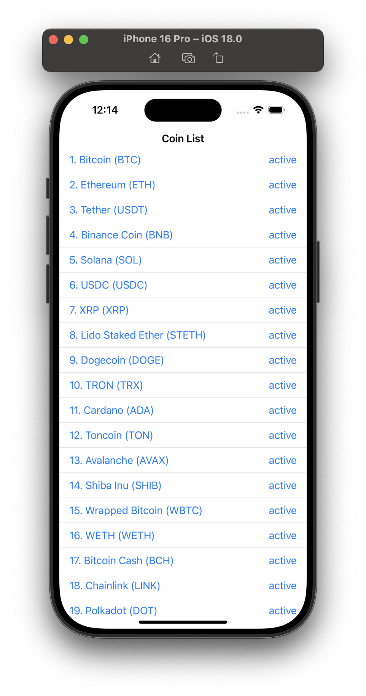
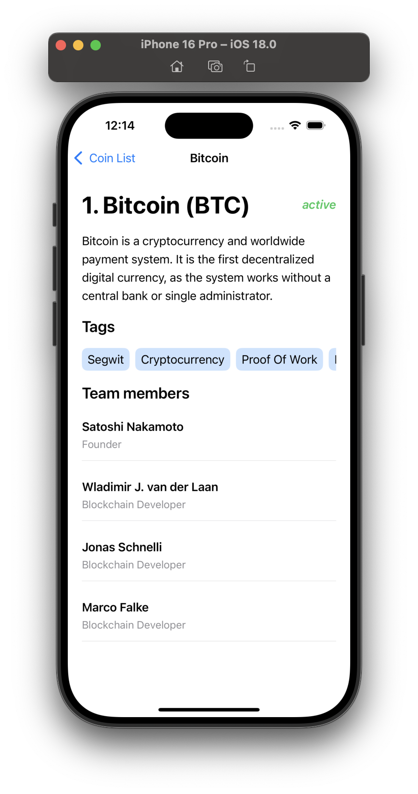

# CryptoApp.iOS

CryptoApp.iOS is an iOS app for tracking cryptocurrency prices, details, and market data. This project is built using Swift and follows best practices for iOS development.

## Features

- View the latest cryptocurrency prices
- Get detailed information about each cryptocurrency
- Real-time updates for cryptocurrency prices
- Search and filter cryptocurrencies by name or symbol

## Technology Used

- **Swift**: Core programming language for iOS development.
- **SwiftUI**: Used for the user interface.
- **UrlSession**: For networking and API calls.
- **Codable**: For parsing API responses.
- **MVVM**: Architecture pattern used in the project.

## Screenshots

| Home Screen | Detail Screen |
|-------------|---------------|
|  |  |

## How It Works

1. The app fetches cryptocurrency data using the [CoinPaprika API](https://api.coinpaprika.com/).
2. Displays the list of cryptocurrencies on the home screen.
3. Tapping on a cryptocurrency shows detailed information on the detail screen.
4. Real-time price updates are shown on the home screen.

## Contributing

Feel free to contribute to this project by opening a pull request. We welcome any improvements or suggestions!

## License

This project is licensed under the MIT License. See the [LICENSE](LICENSE) file for details.
